# 💰 LAB 07: FinOps para IA Generativa — Gestão, Estimativa e Monitoramento de Custos (AWS Bedrock & Serverless)

---

## 🎯 Objetivos de Aprendizagem

Ao final deste laboratório, você será capaz de:
1. **Compreender o ciclo de vida FinOps** (*Inform*, *Optimize*, *Operate*) aplicado à Inteligência Artificial Generativa e Large Language Models (LLMs).
2. **Dominar a Tokenomics de LLMs:** Diferenças de custo entre *Input Tokens* (contexto/prompt) e *Output Tokens* (geração/resposta) e seus impactos no orçamento.
3. **Avaliar o custo de segurança:** Entender como o **AWS Bedrock Guardrails** é tarifado e como balancear proteção semântica e eficiência financeira.
4. **Implementar Shift-Left FinOps:** Estimar despesas operacionais antes de aprovar o deploy de infraestrutura via Terraform e esteira CI/CD.
5. **Rastrear gastos reais consolidados:** Consultar a **AWS Cost Explorer API** para auditar despesas acumuladas na nuvem por serviço.
6. **Monitorar telemetria de inferência em tempo real:** Acompanhar o consumo de tokens e centavos de dólar por requisição e acumulados por sessão de chat.
7. **Aplicar padrões arquiteturais de otimização de custo** em GenAI (*Model Routing*, *Prompt Economy*, *Caching*).

---

## 🧠 Conceito: FinOps para Inteligência Artificial Generativa

Em aplicações de nuvem tradicionais, custos de infraestrutura serverless (AWS Lambda, S3, API Gateway) costumam ser previsíveis e extremamente baixos para volumes moderados, frequentemente cobertos pelo *AWS Free Tier*.

Entretanto, **sistemas baseados em LLMs introduzem uma dinâmica de custo radicalmente diferente**:
* **Custo variável por volume de tokens:** Uma única requisição pode processar milhares de tokens (especialmente com RAG e documentos anexados).
* **Assimetria de preços:** Tokens gerados (*Output Tokens*) chegam a ser de 2 a 4 vezes mais caros que tokens de entrada (*Input Tokens*).
* **Disparidade massiva entre modelos:** Modelos ultraleves (como o *Amazon Nova Micro*) custam frações insignificantes em comparação com modelos avançados ou de grande escala.
* **Custo da camada de defesa semântica:** Cada inspeção de Guardrail avalia políticas de texto e adiciona um valor previsível por requisição.

Sem governança FinOps contínua, uma aplicação de GenAI pode sofrer com surpresas no faturamento (*cloud bill shock*) geradas por loops de agentes, prompts inchados (*prompt bloat*) ou ataques de esgotamento de recursos (*Denial of Wallet*).

```mermaid
flowchart TD
    subgraph Shift_Left ["1. Shift-Left FinOps (Pré-Deploy)"]
        A["Terraform Plan"] --> B["finops_cost_estimator.py"]
        B --> C["Simulação de Cenários<br>(1k, 10k, 100k req/mês)"]
        C --> D["GitHub Actions Step Summary<br>(Gate de Decisão Financeira)"]
    end

    subgraph Runtime_Telemetry ["2. Telemetria em Tempo Real (In-Flight)"]
        E["Usuário no chat.html"] --> F["API Gateway & Lambda"]
        F --> G["Bedrock Converse API"]
        G -->|usage: input/output tokens| F
        F -->|costDetails: USD exato| E
        E --> H["Badge FinOps por Mensagem<br>+ Contador Acumulado da Sessão"]
    end

    subgraph Post_Deploy ["3. Governança Pós-Deploy (Post-Deploy Tracking)"]
        I["AWS Cost Explorer API"] --> J["finops_actual_tracker.py"]
        J --> K["Relatório Consolidado de Gastos Reais<br>(Bedrock, S3, Lambda, API Gateway)"]
    end
```



---

## 📊 Matriz de Tokenomics e Preços do Projeto

A tabela a seguir consolida os custos oficiais de inferência no **Amazon Bedrock (us-east-1)** e serviços satélites utilizados nesta solução:

| Componente / Modelo | Input (por 1.000 tokens) | Output (por 1.000 tokens) | Fator de Economia vs Llama 3 8B |
| :--- | :---: | :---: | :---: |
| ⚡ **Amazon Nova Micro v1** | `$0.000035 USD` | `$0.000140 USD` | **~88% mais barato** |
| 🚀 **Amazon Nova Lite v1** | `$0.000060 USD` | `$0.000240 USD` | **~75% mais barato** |
| 🦙 **Meta Llama 3.1 8B Instruct** | `$0.000220 USD` | `$0.000220 USD` | **~50% mais barato** |
| 🛡️ **Meta Llama 3 8B Instruct** | `$0.000300 USD` | `$0.000600 USD` | Linha de Base (Baseline) |
| 🛡️ **AWS Bedrock Guardrails** | `$0.000750 USD` por requisição de texto (até 1.000 políticas avaliadas) | — | Custo fixo de segurança semântica |
| ⚡ **AWS Lambda** | `$0.20 USD` por 1 milhão de requisições + `$0.0000166667` por GB-segundo *(Gratuito no Free Tier)* | — | Negligível |
| 🚪 **Amazon API Gateway (HTTP)** | `$1.00 USD` por 1 milhão de chamadas *(Gratuito no Free Tier)* | — | Negligível |
| 🪣 **Amazon S3** | `$0.023 USD` por GB/mês *(Gratuito no Free Tier)* | — | Negligível |

> [!IMPORTANT]
> **Insight FinOps:** A infraestrutura serverless (S3, API Gateway, Lambda) representa menos de **1%** do custo total da solução. O verdadeiro direcionador de custo (*cost driver*) são os **tokens consumidos no Bedrock e a avaliação dos Guardrails**.

---

## 🛠️ Roteiro Prático Passo a Passo

### Passo 1: Estimativa de Custos Pré-Deploy (Shift-Left FinOps)

Antes de aprovar qualquer alteração de infraestrutura ou modelo, o time de engenharia executa a ferramenta de estimativa pré-deploy.

1. No terminal do projeto, execute o script de estimativa:
   ```bash
   python deploy/terraform/finops_cost_estimator.py
   ```

2. Observe a saída detalhada contendo:
   - Custo base estático da infraestrutura serverless.
   - Custo projetado para 1.000 requisições/mês nos 4 modelos homologados.
   - Cenários de escalabilidade (1.000, 10.000 e 100.000 chamadas mensais).
   - Custo do Bedrock Guardrail isolado.

3. Para testar a saída formatada em Markdown idêntica à que é injetada na esteira de CI/CD:
   ```bash
   python deploy/terraform/finops_cost_estimator.py --format markdown
   ```

---

### Passo 2: Telemetria de Custo em Tempo Real no Chat (`chat.html`)

A aplicação web agora conta com monitoramento transparente de consumo financeiro por requisição e por sessão.

1. Abra o arquivo `chat.html` no seu navegador ou acesse a URL do site no S3 (obtida via `terraform output s3_website_url`).
2. Observe o **cabeçalho superior direito**:
   - Você verá o selo: `💳 Sessão: $0.000000 USD (0 tokens)`.
3. Realize um teste prático com o **Amazon Nova Micro v1**:
   - Selecione o modelo `Amazon Nova Micro v1`.
   - Desmarque a opção `Bedrock Guardrail`.
   - Digite: `O que é a TechFin Cloud?`
   - Clique em **Enviar**.
   - **Resultado:** Observe a nova badge verde:
     ```text
     💰 FinOps: 56 tokens ≈ $0.000004 USD
     ```
   - O contador do cabeçalho é incrementado com exatidão.

4. Agora realize o mesmo teste com o **Meta Llama 3.1 8B Instruct** e **Bedrock Guardrail Ativado**:
   - Selecione o modelo `Meta Llama 3.1 8B Instruct`.
   - Marque a opção `Bedrock Guardrail`.
   - Digite a mesma pergunta: `O que é a TechFin Cloud?`
   - Clique em **Enviar**.
   - **Resultado:**
     ```text
     💰 FinOps: 58 tokens ≈ $0.000763 USD
     ```
   - Passe o cursor sobre a badge de FinOps para visualizar o detalhamento no *tooltip*:
     `Prompt: 45 tokens | Resposta: 13 tokens | Modelo: $0.0000128 USD | Guardrail: $0.0007500 USD`.

> [!TIP]
> **Exercício de Comparação:** Note que o custo do Guardrail ($0.00075 USD) é maior do que o custo de inferência do próprio modelo Nova Micro ($0.000004 USD). Isso ensina uma lição crítica de arquitetura: para micro-tarefas e alto volume, a estratégia de filtragem deve ser calibrada cuidadosamente.

---

### Passo 3: Rastreamento de Gastos Reais na AWS (AWS Cost Explorer)

Após interagir com o chat e rodar testes automatizados de segurança, consulte quanto sua conta AWS realmente acumulou de cobrança no mês corrente.

1. No seu terminal, execute o rastreador de custos reais:
   ```bash
   python deploy/terraform/finops_actual_tracker.py
   ```

2. Você verá a listagem consolidada direta da API do Cost Explorer:
   ```text
   ================================================================================
    📈 TECHFIN CLOUD - RELATÓRIO DE CUSTOS REAIS ACUMULADOS (AWS COST EXPLORER)
   ================================================================================
   Período de Apuração: 2026-09-01 a 2026-09-11 (Mês Vigente)
   --------------------------------------------------------------------------------
   Serviço AWS                      Descrição                        Gasto Real (USD)
   --------------------------------------------------------------------------------
   ★ Amazon Bedrock                 Modelos LLM e Guardrails         $  0.008872 USD
   ★ Amazon Simple Storage Service  Armazenamento S3 (Frontend e RAG) $  0.000247 USD
   ★ Amazon API Gateway             HTTP API Invocations             $  0.000032 USD
   ★ AWS Lambda                     Funções Serverless               $  0.000000 USD
   ★ AmazonCloudWatch               Métricas, Dashboards e Logs      $  0.000000 USD
   --------------------------------------------------------------------------------
   Total dos Serviços do Projeto:   $  0.009151 USD
   Total Acumulado na Conta AWS:    $  1.186507 USD
   ================================================================================
   ```

3. Note que:
   - Os serviços com estrela (`★`) são os recursos atrelados ao projeto.
   - O AWS Lambda e CloudWatch Logs estão com `$0.000000 USD` devido à franquia mensal gratuita (*Free Tier*).
   - O gasto com Bedrock reflete as chamadas reais realizadas durante as sessões de teste e ataques de Red Teaming.

---

### Passo 4: Auditoria FinOps Contínua no GitHub Actions CI/CD

A esteira de DevSecOps integra a governança de custos em dois momentos-chave:
1. **Durante o Terraform Plan:** Gera a estimativa Shift-Left para que o Tech Lead aprove ou rejeite o pull request com base na projeção orçamentária.
2. **Após o Terraform Apply:** Executa a consulta ao AWS Cost Explorer para registrar o acumulado real do mês no resumo da execução.
3. **Execução sob demanda:** O workflow pode ser acionado a qualquer momento selecionando a ação `finops-audit`.

Para rodar uma auditoria FinOps sob demanda no GitHub Actions:
1. Acesse a aba **Actions** no repositório GitHub.
2. Selecione o workflow **DevSecOps GenAI Pipeline (Terraform & Bedrock Guardrails)**.
3. Clique em **Run workflow**.
4. No campo **Ação a executar**, selecione: `finops-audit`.
5. Clique em **Run workflow**.
6. Ao concluir a execução, abra o **Summary** da run para visualizar o painel comparativo de estimativas e gastos reais consolidados.

---

## 🏛️ Boas Práticas FinOps para Arquiteturas de GenAI

Para manter custos sob controle em larga escala, adote as seguintes práticas corporativas:

### 1. Model Routing & Cascading (Roteamento Dinâmico de Modelos)
Nem toda requisição precisa de um modelo de grande porte:
* Use **Amazon Nova Micro** para: Classificação de intenção, moderação preliminar, extração de entidades e sumarização simples.
* Use **Meta Llama 3.1 8B** para: Raciocínio estruturado, geração de respostas corporativas a partir de RAG e formatação técnica.
* Economia potencial: **70% a 85%** na conta de inferência.

### 2. Prompt Economics (Economia de Contexto)
* Evite injetar bases RAG volumosas desnecessárias. Limite o documento recuperado aos trechos estritamente relevantes (*Chunking & Re-ranking*).
* Reduza System Prompts prolixos; remova metadados redundantes.
* Prefira respostas concisas instruindo o modelo via parâmetro `maxTokens` (ex: 512 ou 1024).

### 3. Semantic Caching (Cache Semântico)
* Perguntas frequentes idênticas ou semanticamente similares (ex: "Qual o limite de almoço?") devem ser respondidas a partir de um cache (Redis / ElastiCache / DynamoDB) com custo de $0.00 em inferência Bedrock.

### 4. Governança de Guardrails sob Medida
* Aplique Guardrails nas mensagens de entrada do usuário (*Input*) e na saída do modelo (*Output*), mas desligue validações redundantes para modelos internos já pré-alinhados quando o contexto operacional permitir.

### 5. Alertas de Orçamento (AWS Budgets)
* Configure um **AWS Budget** com limite de alerta (ex: `$10.00 USD/mês`) com notificações automáticas via Amazon SNS ou e-mail corporativo.

---

## ✅ Critérios de Sucesso e Validação

Você concluiu este laboratório com sucesso se:
- [x] O script `finops_cost_estimator.py` executa e projeta cenários de custo com precisão.
- [x] O script `finops_actual_tracker.py` se comunica com o AWS Cost Explorer e reporta os gastos reais da conta.
- [x] O chat web (`chat.html`) exibe a badge `💰 FinOps` em cada resposta e mantém o saldo acumulado da sessão no cabeçalho.
- [x] O backend `bedrockChatFunction.py` retorna o objeto `costDetails` com tokens e custos em USD discriminados.
- [x] A esteira do GitHub Actions inclui estimativas no Step Summary e suporta auditorias sob demanda via `finops-audit`.

---

👉 **Próximo Laboratório:** [LAB 08 - Resiliência em IA Generativa: Multi-Model Fallback & Circuit Breaker (AWS Bedrock & Lambda)](LAB08_GenAI_Resilience_MultiModel_Fallback.md)

