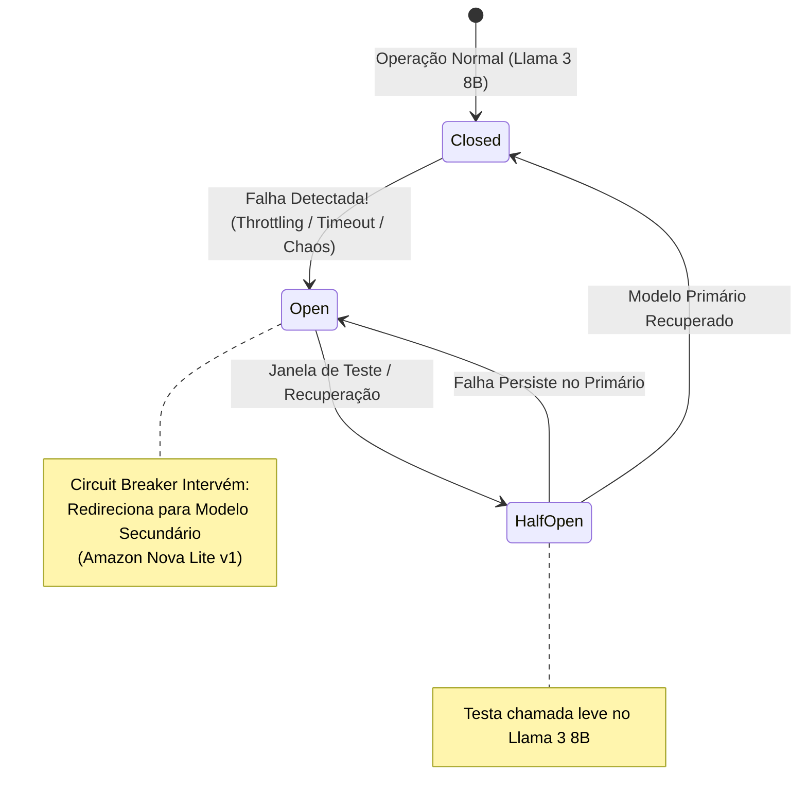
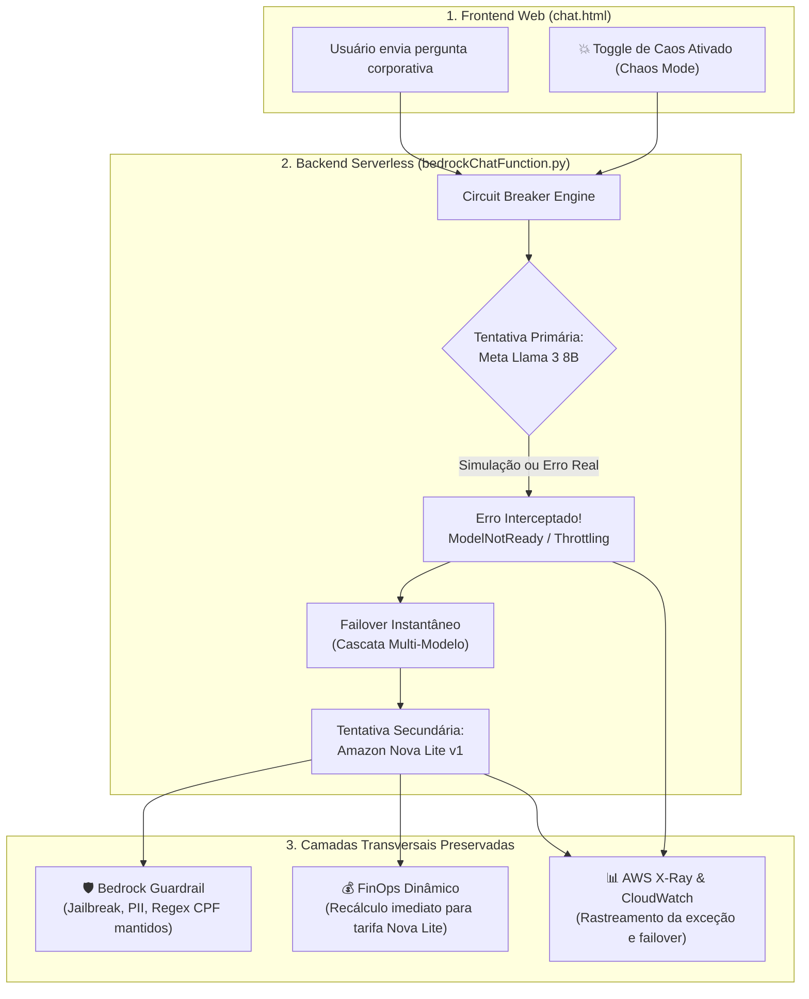

# 🔄 LAB 08: Resiliência em IA Generativa — Multi-Model Fallback & Circuit Breaker (AWS Bedrock & Lambda)

---

## 🎯 Objetivos de Aprendizagem

Ao final deste laboratório, você será capaz de:
1. **Compreender o Pilar de Confiabilidade (*Reliability Pillar*)** do *AWS Well-Architected Framework* aplicado a soluções de Inteligência Artificial Generativa.
2. **Identificar as principais fontes de indisponibilidade em LLMs:** *Throttling* por quotas de concorrência (`ThrottlingException`), esgotamento de *Tokens Per Minute (TPM)* ou *Requests Per Minute (RPM)*, picos de latência e interrupções temporárias de clusters de GPUs.
3. **Dominar o padrão de projeto *Circuit Breaker*:** Estados *Closed*, *Open* e *Half-Open* para evitar o efeito cascata (*cascading failure*) e preservar a experiência do usuário.
4. **Implementar Cascata Multi-Modelo (*Model Cascading & Fallback*):** Chaveamento transparente e automatizado do modelo primário (**Meta Llama 3 8B**) para o modelo secundário (**Amazon Nova Lite v1**).
5. **Praticar Engenharia de Caos (*Chaos Engineering*):** Injetar falhas controladas em tempo de execução para validar a tolerância a falhas do sistema sem gerar degradação para o usuário final.
6. **Avaliar a sinergia entre Resiliência, Segurança (Guardrails) e FinOps:** Observar como as políticas de segurança e a precificação de tokens se comportam durante o failover.

---

## 🧠 Conceito: Por Que LLMs Exigem Arquitetura de Contingência?

Em arquiteturas convencionais de Cloud Computing, componentes serverless (AWS Lambda, API Gateway e DynamoDB) possuem SLAs superiores a 99.95% e escalabilidade quase instantânea.

Contudo, **serviços de inferência de LLMs (como o Amazon Bedrock) operam sob restrições físicas severas de hardware (GPUs especializadas)**:
* **Quotas Estritas de Concorrência:** Contas AWS iniciam com limites modestos de requisições e tokens por minuto por modelo. Picos súbitos de tráfego geram erros `429 Too Many Requests` ou `ThrottlingException`.
* **Indisponibilidade Não Planejada do Fornecedor:** Se o cluster de um modelo de terceiros apresentar instabilidade, toda a aplicação corporativa fica paralisada se depender de um único modelo (*Single Point of Failure*).
* **Degradação de Latência (Tail Latency):** Em momentos de alta demanda global, a geração de tokens pode sofrer lentidão severa.

### A Solução: Padrão Circuit Breaker com Failover Multi-Modelo

O padrão **Circuit Breaker** monitora chamadas ao modelo primário. Quando detecta falha, sobrecarga ou timeout, ele abre o circuito e redireciona instantaneamente a requisição para um modelo de contingência (de família diferente ou ultraleve), garantindo resposta em frações de segundo.



---

## 🏗️ Matriz de Contingência e Arquitetura da Solução

Nossa solução serverless foi desenhada para executar a cascata com total transparência:



### Comparativo entre os Modelos da Cascata:

| Papel na Cascata | Modelo Bedrock | Tempo Médio de Resposta | Custo Input / Output (1k tokens) |
| :--- | :--- | :---: | :---: |
| 🥇 **Primário (Principal)** | `meta.llama3-8b-instruct-v1:0` | ~1.200 ms | `$0.000300` / `$0.000600 USD` |
| 🥈 **Secundário (Contingência)** | `us.amazon.nova-lite-v1:0` | ~450 ms | `$0.000060` / `$0.000240 USD` *(~75% mais barato)* |
| 🥉 **Terciário (Degradado)** | `us.amazon.nova-micro-v1:0` | ~210 ms | `$0.000035` / `$0.000140 USD` *(~88% mais barato)* |

> [!TIP]
> **Vantagem FinOps do Fallback:** Ao cair para o Amazon Nova Lite v1, o sistema não apenas recupera a disponibilidade em milissegundos, como também reduz o custo daquela requisição em mais de **70%**!

---

## 🛠️ Roteiro Prático Passo a Passo

### Passo 1: Operação Normal no Chat (Linha de Base)

1. Abra a aplicação web [`chat.html`](../chat.html) no navegador (ou pela URL do S3: `terraform output s3_website_url`).
2. No painel de configuração:
   - Certifique-se de que o **Modelo Bedrock** está selecionado como `Meta Llama 3 8B Instruct`.
   - Certifique-se de que a opção **💥 Simular Falha (Chaos)** está **desmarcada**.
3. Digite:
   > *"Qual é a importância de uma política de segurança em nuvem?"*
4. Clique em **Enviar**.
5. **Resultado Esperado:**
   - Resposta gerada normalmente pelo `meta.llama3-8b-instruct-v1:0`.
   - Selo FinOps calcula o custo na faixa do Llama 3 8B.
   - Nenhum selo de failover é exibido.

---

### Passo 2: Injeção de Caos e Demonstração do Circuit Breaker

Agora vamos simular que o cluster do Meta Llama 3 8B sofreu indisponibilidade ou esgotamento de quota na AWS.

1. No menu superior (**⚡ Testes OWASP & Resiliência**), selecione o teste pré-configurado:
   - `[LAB 08] Resiliência: Teste de Failover Automático (Circuit Breaker)`
2. Note que a opção **💥 Simular Falha (Chaos)** foi automaticamente ativada com destaque em vermelho!
3. Clique em **Enviar**.
4. **Resultado Esperado no Chat:**
   - A resposta chega perfeitamente redigida, **sem que o usuário final receba qualquer mensagem de erro HTTP 500 ou tela quebrada**!
   - Abaixo da mensagem, surge o selo em destaque laranja pulsante:
     ```text
     🔄 Circuit Breaker Failover: meta.llama3-8b-instruct-v1:0 (Falha) ➔ Chaveado para us.amazon.nova-lite-v1:0
     ```
   - Passe o cursor sobre o selo para visualizar o motivo do failover no tooltip:
     `Motivo do Failover: ModelNotReadyException: Simulação de Caos (LAB 08): Modelo primário [meta.llama3-8b-instruct-v1:0] indisponível por sobrecarga temporária.`
   - O selo verde `💰 FinOps` calcula o custo da inferência já com a tarifa reduzida do Amazon Nova Lite v1!

---

### Passo 3: Auditoria dos Logs de Failover no AWS CloudWatch

Para demonstrar a observabilidade do Circuit Breaker:

1. No console da AWS, navegue até **CloudWatch > Log Groups**.
2. Abra o grupo de logs da função: `/aws/lambda/techfin-bedrock-chat-function`.
3. Abra o stream mais recente. Você verá os registros explícitos da transição de estado:
   ```text
   💥 CHAOS ENGINEERING ATIVADO: Forçando falha simulada do modelo primário [meta.llama3-8b-instruct-v1:0].
   ⚡ CIRCUIT BREAKER OPEN: Falha no modelo primário [meta.llama3-8b-instruct-v1:0] (ModelNotReadyException).
   🔄 Executando failover instantâneo para o modelo secundário [us.amazon.nova-lite-v1:0]...
   ✔ Failover concluído com sucesso! Resposta gerada por [us.amazon.nova-lite-v1:0].
   ```

---

### Passo 4: Validação Automatizada de Resiliência via CLI

Para garantir conformidade contínua e inclusão em pipelines de CI/CD, execute a suíte de testes automatizados do laboratório:

```powershell
python deploy/terraform/tests/test_lab08_resilience_fallback.py
```

O script executará 3 baterias de validação:
1. **Operação Normal:** Confirma que o Llama 3 8B responde quando saudável.
2. **Injeção de Caos:** Dispara a simulação de falha e valida que a API retorna HTTP 200 com chaveamento para o Nova Lite e metadados de resiliência íntegros.
3. **Preservação de Guardrails:** Valida que mesmo durante o chaveamento, as políticas de segurança e bloqueio continuam ativas no modelo secundário.

Saída esperada no terminal:
```text
===========================================================================
   TESTES DE RESILIÊNCIA GENAI: MULTI-MODEL FALLBACK & CIRCUIT BREAKER
===========================================================================
🎯 Endpoint Alvo   : https://wwze7wih11.execute-api.us-east-1.amazonaws.com/chat
🧠 Modelo Primário : meta.llama3-8b-instruct-v1:0
🛡️ Modelo Fallback : us.amazon.nova-lite-v1:0
---------------------------------------------------------------------------

[1/3] Testando Operação Normal (Sem Falha / Baseline)...
  ✔ SUCESSO: Modelo primário respondeu normalmente sem acionamento de fallback.
  Modelo Ativo: meta.llama3-8b-instruct-v1:0 | Circuit Breaker: CLOSED

[2/3] Testando Injeção de Caos & Failover Automático para Contingência...
  ✔ SUCESSO (CIRCUIT BREAKER ATUOU):
  - Falha Primária Interceptada : meta.llama3-8b-instruct-v1:0
  - Chaveado com Sucesso para   : us.amazon.nova-lite-v1:0
  - Estado do Circuit Breaker   : OPEN_FALLBACK
  - Motivo Registrado           : ModelNotReadyException: Simulação de Caos (LAB 08)...
  - Telemetria FinOps no Failover: 542 tokens ≈ $0.000108 USD
  - Trecho da Resposta          : "Tolerância a falhas em arquiteturas de nuvem é a capacidade de um sistema..."

[3/3] Testando Preservação da Camada de Segurança (Guardrail) sob Failover...
  ✔ SUCESSO: Failover concluído para [us.amazon.nova-lite-v1:0] E Guardrail bloqueou violação de compliance!
  - Intervenção Guardrail: True
  - Modelo que Executou   : us.amazon.nova-lite-v1:0

===========================================================================
  🎉 TODOS OS TESTES DE RESILIÊNCIA E CIRCUIT BREAKER FORAM APROVADOS!
  A arquitetura possui alta disponibilidade e tolerância a falhas em GenAI.
===========================================================================
```

---

## 🏛️ Boas Práticas Corporativas de Resiliência em GenAI

1. **Evite Dependência de Fornecedor Único de Modelos:** Projete aplicações corporativas com suporte a pelo menos dois provedores ou famílias distintas (ex: Meta Llama + Amazon Nova ou Anthropic Claude).
2. **Exponential Backoff com Jitter:** Para falhas transitórias de rede ou `ThrottlingException`, realize até 2 retentativas rápidas com atraso aleatório (*jitter*) antes de abrir o circuito para o modelo secundário.
3. **Alinhamento de Prompts entre Modelos:** Modelos diferentes possuem peculiaridades de formatação. O uso da **Amazon Bedrock Converse API** unifica a estrutura de mensagens e isola sua aplicação de discrepâncias de sintaxe entre os provedores.
4. **Cache Semântico de Contingência:** Em situações de pane generalizada, utilize respostas em cache (*Stale-While-Revalidate*) para perguntas frequentes.
5. **Observabilidade de Incidentes de IA:** Configure alarmes do CloudWatch disparados quando a métrica de failover for acionada mais de 5 vezes em um intervalo de 5 minutos.

---

## 💬 Questões para Discussão em Aula

1. **Degradação Graciosa vs Falha Catastrófica:** Qual o impacto no negócio quando uma aplicação de atendimento ao cliente responde com um modelo menor (*Nova Lite*) versus apresentar um erro genérico de "Sistema Indisponível"?
2. **Dilema de Segurança no Failover:** Se o modelo de contingência não suportar as mesmas capacidades de alinhamento nativo do modelo primário, por que os **AWS Bedrock Guardrails** tornam-se a âncora de segurança indispensável?
3. **FinOps Inverso:** Em quais cenários faz sentido transformar o modelo secundário mais barato no modelo primário padrão (*Model Routing* por complexidade de intenção)?

---

## ✅ Critérios de Sucesso e Validação

Você concluiu este laboratório com sucesso se:
- [x] O backend `bedrockChatFunction.py` intercepta falhas e chaveia automaticamente para o modelo secundário.
- [x] O frontend `chat.html` oferece controle de injeção de caos (`💥 Simular Falha`) e exibe o selo `🔄 Circuit Breaker Failover`.
- [x] A camada de segurança do Bedrock Guardrail continua bloqueando ameaças mesmo sob failover.
- [x] A telemetria FinOps recalcula os custos com exatidão baseando-se no modelo ativo da contingência.
- [x] O script `test_lab08_resilience_fallback.py` conclui com 100% de sucesso.
